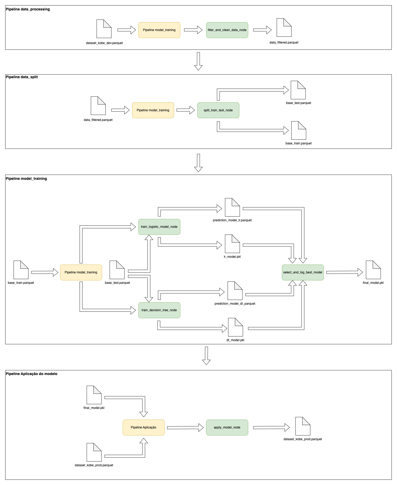

# 🏀 Kobe Shot Prediction

Este projeto usa técnicas de Machine Learning e engenharia de dados para prever se um arremesso de Kobe Bryant foi **cesta ou erro**, com base em informações contextuais da jogada.

---

## 📊 Etapas do projeto

| Etapa                          | Descrição |
|-------------------------------|-----------|
| **Aquisição dos dados**       | Importação dos arquivos `.parquet` com as jogadas |
| **Processamento**             | Remoção de dados nulos, seleção de variáveis |
| **Divisão treino/teste**      | Separação estratificada (80/20) |
| **Treinamento**               | Modelos: regressão logística e árvore de decisão |
| **Avaliação**                 | Métricas: Log Loss e F1-Score (registradas no MLFlow) |
| **Deploy**                    | Salvamento e aplicação do modelo final |
| **Dashboard**                 | Interface com Streamlit para análise em produção |

---

## 📊 Dashboard de Monitoramento

Dashboard criado com Streamlit para monitorar os resultados em produção.

### Como executar:

```bash
streamlit run dashboard.py
```

Você poderá visualizar:

- ✅ Taxa de acerto
- 📉 Distribuição das previsões
- 🔍 Amostras das predições feitas
- 🧠 Interface leve e responsiva

---

## 🛠️ Como executar o projeto localmente

1. Clone o repositório
2. Crie um ambiente virtual com Python 3.10+
3. Instale as dependências:

```bash
pip install -r requirements.txt
```

4. Execute o pipeline completo:

```bash
kedro run
```

5. Inicie o dashboard:

```bash
streamlit run dashboard.py
```

---

## 📚 Referências

- Framework TDSP (Microsoft)
- PyCaret 3.x
- Kedro docs
- MLFlow docs
- Dataset Kobe Bryant [original no Kaggle](https://www.kaggle.com/datasets/kobe24/kobe-bryant-shot-selection)

---

## 💼 Sobre este projeto

### 2. Iremos desenvolver um preditor de arremessos usando duas abordagens (regressão e classificação) para prever se o "Black Mamba" (apelido de Kobe) acertou ou errou a cesta.

## 🔧 Arquitetura do Pipeline



> 📝 O diagrama acima foi criado com [draw.io](https://app.diagrams.net).  
> Você pode editá-lo no arquivo [`docs/diagram.drawio`](docs/diagram.drawio)

## 📁 Estrutura do projeto

Projeto desenvolvido seguindo o **Framework TDSP da Microsoft** com foco em boas práticas de MLOps e reprodutibilidade com Kedro.

```
kobe-shot-prediction-ml/
├── conf/                      # Configurações de pipeline e parâmetros (por ambiente)
├── data/                      # Diretórios organizados por estágios do pipeline
│   ├── 01_raw/                # Dados brutos (originais)
│   ├── 02_intermediate/       # Dados processados parcialmente
│   ├── 03_primary/            # Dados limpos, estruturados
│   ├── 04_features/           # Dados com features engenheiradas
│   ├── 05_model_input/        # Base pronta para treinamento
│   ├── 06_models/             # Modelos treinados (.pkl)
│   ├── 07_model_output/       # Predições e inferências
│   └── 08_reporting/          # Relatórios finais, comparações e visualizações
│
├── docs/                      # Documentação e diagramas do projeto
├── logs/                      # Logs do Kedro
├── mlruns/                    # Diretório de tracking do MLflow
├── notebooks/                 # Notebooks auxiliares ou exploratórios
├── src/kobe_shot_prediction_ml/
│   ├── nodes/                 # Funções puras (transformações, treinos, predições)
│   ├── pipelines/             # Definição e orquestração das pipelines
│   ├── pipeline_registry.py   # Registro central das pipelines
│   ├── settings.py            # Configurações globais do projeto
│   └── dashboard.py           # (Opcional) scripts para visualizações ou dashboards
│
├── pyproject.toml             # Configuração de dependências e metadata do projeto
├── requirements.txt           # Dependências adicionais
└── README.md                  # Documentação principal do projeto
```

### 3. Como as ferramentas Streamlit, MLflow, PyCaret e Scikit-Learn auxiliam na construção dos pipelines?

## 🚀 Tecnologias utilizadas

- [Kedro](https://kedro.readthedocs.io/en/stable/) – Orquestração de pipelines
- [PyCaret](https://pycaret.org/) – Treinamento automatizado de modelos
- [MLFlow](https://mlflow.org/) – Rastreamento de experimentos e deployment
- [Scikit-learn](https://scikit-learn.org/) – Métricas e suporte a modelos
- [Streamlit](https://streamlit.io/) – Dashboard interativo
- [Pandas, Parquet, PyArrow] – Manipulação de dados

## ⚙️ Tecnologias e Funções no Pipeline de Machine Learning

Este projeto utiliza ferramentas modernas para construir, rastrear, atualizar e disponibilizar modelos de machine learning de ponta a ponta. Abaixo está a descrição do papel de cada uma delas no pipeline:

### 🧩 Ferramentas Utilizadas

| Ferramenta     | Função Principal                                               |
|----------------|----------------------------------------------------------------|
| **Scikit-learn** | Base para modelos, métricas e transformações tradicionais     |
| **PyCaret**      | Abstração para automação de experimentos e pipelines de ML    |
| **MLflow**       | Rastreabilidade, versionamento e gerenciamento de modelos     |
| **Streamlit**    | Interface interativa para visualização, validação e deploy    |

---

### 🔍 Como cada ferramenta auxilia no pipeline

#### **a. Rastreamento de Experimentos** – *MLflow + PyCaret*
- Armazena os parâmetros utilizados nos experimentos (`test_size`, `model_type`)
- Registra métricas como `log_loss`, `f1_score`, etc.
- Permite comparar execuções anteriores e promover o melhor modelo
- PyCaret já loga automaticamente os experimentos no MLflow

#### **b. Funções de Treinamento** – *PyCaret + Scikit-learn*
- PyCaret automatiza o fluxo: `setup`, `create_model`, `tune_model`, `predict_model`
- Scikit-learn é usado para métricas manuais, validação e nodes personalizados
- Ambos são integrados aos pipelines do Kedro

#### **c. Monitoramento da Saúde do Modelo** – *MLflow + Streamlit*
- MLflow mantém histórico de métricas e modelos
- Permite detectar degradação de performance entre versões
- Streamlit pode exibir dashboards com métricas, distribuição de predições e alertas

#### **d. Atualização de Modelo** – *PyCaret + Kedro + MLflow*
- Novos dados podem ser passados para o `setup()` do PyCaret
- O pipeline gera um novo modelo, avalia, e registra uma nova versão no MLflow
- O Kedro automatiza esse processo mantendo o controle de artefatos

#### **e. Provisionamento (Deployment)** – *Streamlit + MLflow + Scikit-learn*
- Streamlit permite criar uma interface para usuários testarem o modelo
- MLflow pode servir o modelo via REST API
- Modelos `.pkl` treinados com Scikit-learn ou PyCaret podem ser integrados em APIs, dashboards ou sistemas externos

---

### 4. Com base no diagrama realizado na questão 2, aponte os artefatos que serão criados ao longo de um projeto. Para cada artefato, a descrição detalhada de sua composição.

## 📦 Artefatos Gerados no Pipeline

Abaixo estão os artefatos criados ao longo das etapas do pipeline, conforme representado no diagrama:

---

### 🔹 Pipeline: `data_processing`

#### `data_filtered.parquet`
- **Descrição**: Base original (`dataset_kobe_dev.parquet`) após limpeza e filtragem de colunas/linhas irrelevantes.
- **Composição**:
  - Colunas relevantes para o modelo
  - Sem valores nulos ou inconsistentes
  - Pode conter dados balanceados ou amostrados

---

### 🔹 Pipeline: `data_split`

#### `base_train.parquet`
- **Descrição**: Conjunto de dados usado para **treinamento** dos modelos.
- **Composição**:
  - Subconjunto da `data_filtered.parquet`
  - Separado com base no parâmetro `test_size`
  - Inclui variáveis preditoras e a variável alvo

#### `base_test.parquet`
- **Descrição**: Conjunto de dados usado para **validação/teste** dos modelos.
- **Composição**:
  - Complementar ao `base_train.parquet`
  - Utilizado para cálculo de métricas de performance

---

### 🔹 Pipeline: `model_training`

#### `lr_model.pkl`
- **Descrição**: Modelo de regressão logística treinado.
- **Composição**:
  - Objeto serializado `.pkl` com o modelo e transformações
  - Exportado via PyCaret ou Scikit-learn

#### `dt_model.pkl`
- **Descrição**: Modelo de árvore de decisão treinado.
- **Composição**:
  - Mesmo formato do `lr_model.pkl`, treinado com outro algoritmo

#### `prediction_model_lr.parquet`
- **Descrição**: Predições geradas pelo modelo de regressão logística.
- **Composição**:
  - Colunas: `shot_made_flag`, `prediction_label`, `prediction_score`, etc.

#### `prediction_model_dt.parquet`
- **Descrição**: Predições geradas pelo modelo de árvore de decisão.
- **Composição**:
  - Mesmo formato do arquivo anterior

#### `final_model.pkl`
- **Descrição**: Modelo selecionado como o melhor (menor `log_loss`).
- **Composição**:
  - Modelo final aprovado para uso em produção
  - Pode ser o `lr_model` ou `dt_model`

---

### 🔹 Pipeline: `Aplicação de modelo`

#### `dataset_kobe_prod.parquet`
- **Descrição**: Resultado da aplicação do `final_model.pkl` em dados de produção.
- **Composição**:
  - Dados originais de produção + predições
  - Ex: `prediction_label`, `score`, `id`, etc.

---

### 5. Separação entre treino e teste e impacto no modelo final

Separar bem os dados de treino e teste é uma etapa importante pra garantir que o modelo funcione de verdade e não só "decore" os dados. Se a gente usa um conjunto de treino que é muito diferente do teste, o modelo pode parecer bom durante o desenvolvimento, mas falhar quando for colocado pra rodar de verdade.

Pra evitar esse tipo de problema, algumas práticas ajudam bastante:
- Dividir os dados de forma equilibrada (mantendo a proporção entre acertos e erros, por exemplo)
- Embaralhar os dados antes de separar em treino e teste
- Usar validação cruzada pra testar o modelo em várias divisões diferentes
- Analisar os dados antes de treinar, pra ver se estão bem distribuídos

#### Sobre os dados:
- O dataset original tinha por volta de **24.271 registros** e **25 colunas**
- Depois que removemos os registros sem informação no `shot_made_flag`, ficaram **20.285 registros** e **7 colunas**
- Esses dados foram salvos no arquivo: `data/processed/data_filtered.parquet`

---

### 6. Pipeline de Treinamento com MLflow (`Treinamento`)

Após comparar as métricas de ambos os modelos (log loss e F1), o modelo com **melhor desempenho em log loss** foi escolhido como modelo final. Essa escolha foi feita automaticamente no pipeline por meio de um node de seleção. 

Durante o treinamento, tanto o modelo de regressão logística quanto o de árvore de decisão apresentaram **métricas muito próximas**. Isso levantou uma dúvida: qual métrica usar para escolher o melhor modelo?

Decidi usar o **log loss** como critério principal, porque:

- Ele não olha só se o modelo acertou ou errou, mas **também leva em conta a confiança da predição**
- Um erro com **muita certeza** (por exemplo, prever que a chance era 95% e errar) é penalizado mais fortemente
- Isso faz o log loss ser uma métrica mais exigente e justa quando trabalhamos com **probabilidades** ao invés de só rótulos

Mesmo que dois modelos tenham um `f1_score` parecido, o log loss nos ajuda a entender **quem está mais calibrado** nas suas previsões.

---

### 7. Pipeline de Aplicação com MLflow (`PipelineAplicacao`)

## 📈 Análise de Aderência do Modelo em Produção

**Resultados observados:**

- `F1 Score (produção)`: **0.34**
- `Log Loss (produção)`: **16.44**

**O modelo **não é aderente** à nova base:**

Esses valores indicam que o modelo teve dificuldade em generalizar para a nova distribuição dos dados.  
Diferenças em `lat`, `lon` e demais variáveis indicam um possível **data drift** em relação à base de treino.

**Justificativa**

O modelo foi treinado com uma base que provavelmente apresenta **outras posições de arremesso (lat/lon) e outras condições de jogo.**
Ao ser aplicado em uma base nova com características diferentes, **ele está fazendo previsões com alta confiança em situações que ele não conhece bem**, o que leva ao aumento do erro (log loss alto) e queda no F1.

## 🔍 Monitoramento da Saúde do Modelo e Estratégias de Retreinamento

### Monitoramento da saúde do modelo (com e sem variável de resposta)

| Cenário | Estratégia de Monitoramento |
|--------|------------------------------|
| **Com variável de resposta** | - Calcular métricas como `f1_score`, `log_loss`, `accuracy`<br>- Comparar predições com rótulos reais<br>- Atualizar dashboards com métricas de performance |
| **Sem variável de resposta** | - Monitorar distribuição dos dados de entrada (ex: `lat`, `lon`, etc.)<br>- Detectar *data drift* com testes estatísticos (ex: PSI, KS Test)<br>- Observar mudanças no padrão das predições (prediction drift)<br>- Validar presença de valores nulos, outliers, entradas inesperadas |

---

### Estratégias de retreinamento do modelo

| Estratégia | Descrição |
|------------|-----------|
| **Reativa** | Ocorre quando é identificada uma degradação na performance do modelo (ex: queda no `f1_score`, aumento no `log_loss`). Um novo modelo é treinado com dados mais recentes. |
| **Preditiva** | O retreinamento ocorre de forma agendada (ex: mensal, trimestral), mesmo que o modelo ainda esteja performando bem. Previne obsolescência causada por mudanças lentas nos dados. |

> Ambas as estratégias podem ser combinadas em um pipeline de MLOps automatizado com validações e alertas.

## ✨ Inspiração

> *"The most important thing is to try and inspire people so that they can be great in whatever they want to do."*  
> — Kobe Bryant
